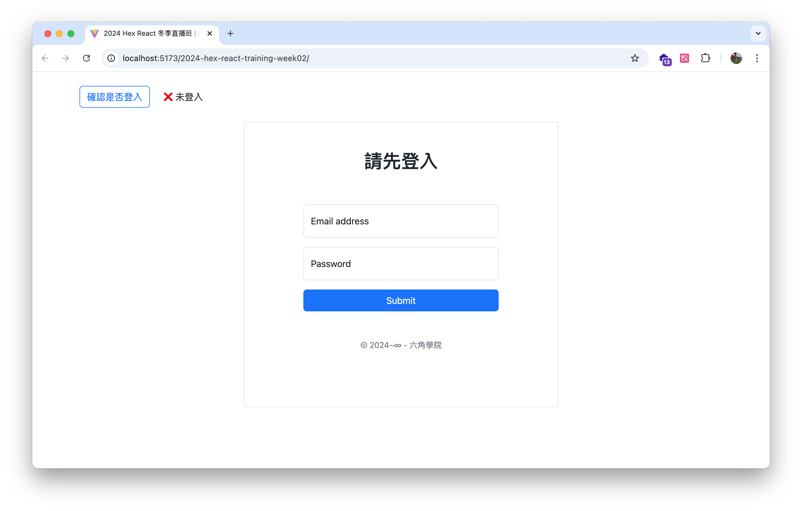
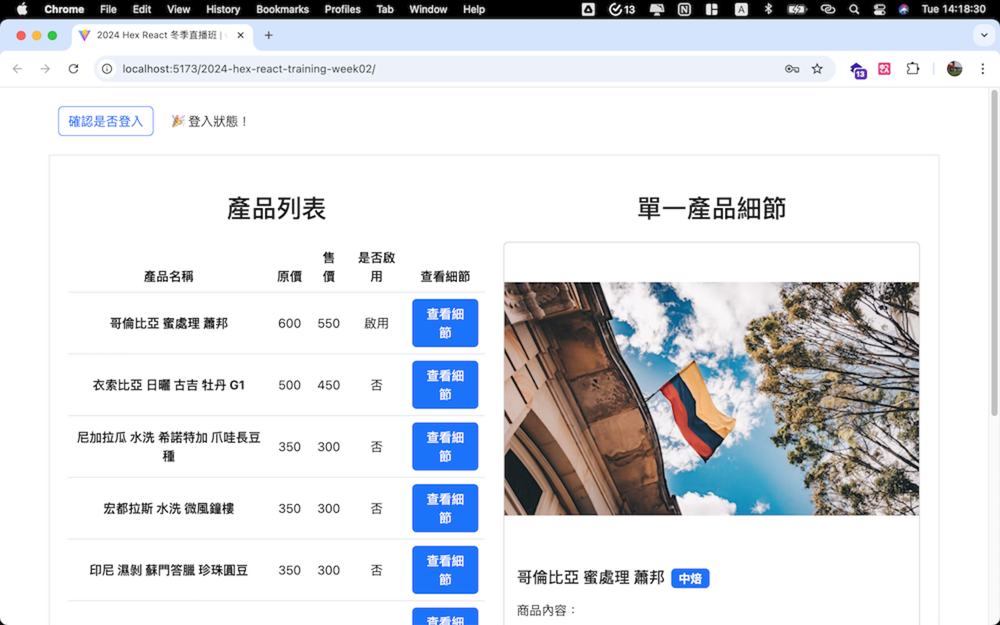

# 📦 2024 Hex React Week 02 主線任務 - RESTful API 串接

這是課程中第二週主線任務的專案。  
本週目標是學會如何使用 Axios 串接 RESTful API 並實作登入驗證與產品列表展示功能。

🔗 [前往 Demo](https://itsdaiyy.github.io/2024-hex-react-training-week02/)

---

### 🚀 測試用帳號

```
帳號：ollie@test.com
密碼：ollieollie01
```

---

### ✨ 使用者功能

- 使用者可以從登入頁面登入，並轉到後台商品頁面
- 使用者若無登入直接進入商品頁面，會被導回登入頁面
- 使用者可以查看產品列表
- 使用者可以點擊單一產品，查看詳細資訊

---

### 🎯 專案學習重點

- 使用 Axios 串接 RESTful API 並處理回應資料
- 理解 Promise 與非同步流程控制
- 建立簡易的登入驗證與頁面保護邏輯

---

### 🛠 使用技術

- **前端框架 |** React (Vite)
- **樣式設計 |** CSS Modules, Bootstrap
- **專案部署 |** GitHub Pages

---

### 📸 專案截圖



